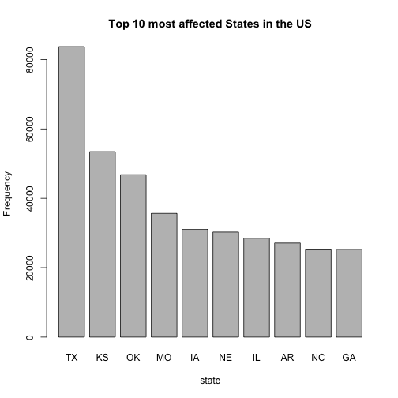
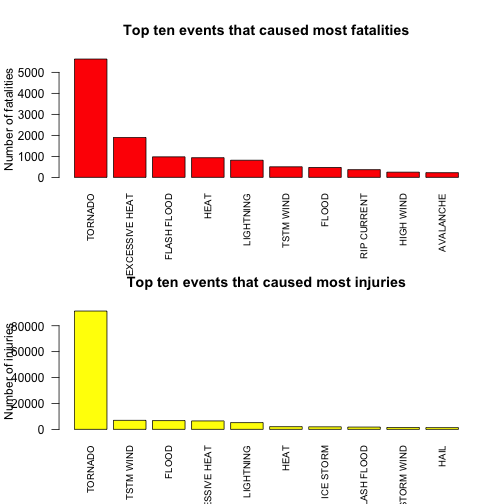
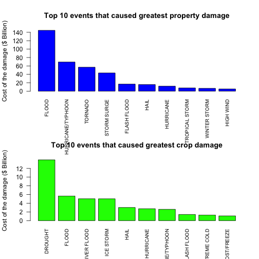

The impact of Severe Weather in the US
========================================================

#### In this data analysis project, I used the data from NOAA Storm Database to analyze the impact of severe weather events. By looking into the data, I mainly asked three questions. They are which states are most affected by the severe weather, which types of events are most harmful with respect to population health and which types of events have the greatest economic consequences.

# Load the data into R

```r
library(R.utils)
```

```
## Warning: package 'R.utils' was built under R version 3.1.1
```

```
## Loading required package: R.oo
## Loading required package: R.methodsS3
## R.methodsS3 v1.6.1 (2014-01-04) successfully loaded. See ?R.methodsS3 for help.
## R.oo v1.18.0 (2014-02-22) successfully loaded. See ?R.oo for help.
## 
## Attaching package: 'R.oo'
## 
## The following objects are masked from 'package:methods':
## 
##     getClasses, getMethods
## 
## The following objects are masked from 'package:base':
## 
##     attach, detach, gc, load, save
## 
## R.utils v1.34.0 (2014-10-07) successfully loaded. See ?R.utils for help.
## 
## Attaching package: 'R.utils'
## 
## The following object is masked from 'package:utils':
## 
##     timestamp
## 
## The following objects are masked from 'package:base':
## 
##     cat, commandArgs, getOption, inherits, isOpen, parse, warnings
```

```r
#download the data from the website
if (!file.exists("/Users/helenxu/Desktop/Coursera/Reproducible Research/PeerAssessment02/repdata-data-StormData.csv.bz2")) {
    download.file("http://d396qusza40orc.cloudfront.net/repdata%2Fdata%2FStormData.csv.bz2","/Users/helenxu/Desktop/Coursera/Reproducible Research/PeerAssessment02/repdata-data-StormData.csv.bz2")
}
if (!file.exists("/Users/helenxu/Desktop/Coursera/Reproducible Research/PeerAssessment02/repdata-data-StormData.csv")) {
    bunzip2("/Users/helenxu/Desktop/Coursera/Reproducible Research/PeerAssessment02/repdata-data-StormData.csv.bz2","/Users/helenxu/Desktop/Coursera/Reproducible Research/PeerAssessment02/repdata-data-StormData.csv",remove = FALSE )
}

data = read.csv("repdata-data-StormData.csv")

# Let's take a look at the data.
str(data)
```

```
## 'data.frame':	902297 obs. of  37 variables:
##  $ STATE__   : num  1 1 1 1 1 1 1 1 1 1 ...
##  $ BGN_DATE  : Factor w/ 16335 levels "1/1/1966 0:00:00",..: 6523 6523 4242 11116 2224 2224 2260 383 3980 3980 ...
##  $ BGN_TIME  : Factor w/ 3608 levels "00:00:00 AM",..: 272 287 2705 1683 2584 3186 242 1683 3186 3186 ...
##  $ TIME_ZONE : Factor w/ 22 levels "ADT","AKS","AST",..: 7 7 7 7 7 7 7 7 7 7 ...
##  $ COUNTY    : num  97 3 57 89 43 77 9 123 125 57 ...
##  $ COUNTYNAME: Factor w/ 29601 levels "","5NM E OF MACKINAC BRIDGE TO PRESQUE ISLE LT MI",..: 13513 1873 4598 10592 4372 10094 1973 23873 24418 4598 ...
##  $ STATE     : Factor w/ 72 levels "AK","AL","AM",..: 2 2 2 2 2 2 2 2 2 2 ...
##  $ EVTYPE    : Factor w/ 985 levels "   HIGH SURF ADVISORY",..: 834 834 834 834 834 834 834 834 834 834 ...
##  $ BGN_RANGE : num  0 0 0 0 0 0 0 0 0 0 ...
##  $ BGN_AZI   : Factor w/ 35 levels "","  N"," NW",..: 1 1 1 1 1 1 1 1 1 1 ...
##  $ BGN_LOCATI: Factor w/ 54429 levels ""," Christiansburg",..: 1 1 1 1 1 1 1 1 1 1 ...
##  $ END_DATE  : Factor w/ 6663 levels "","1/1/1993 0:00:00",..: 1 1 1 1 1 1 1 1 1 1 ...
##  $ END_TIME  : Factor w/ 3647 levels ""," 0900CST",..: 1 1 1 1 1 1 1 1 1 1 ...
##  $ COUNTY_END: num  0 0 0 0 0 0 0 0 0 0 ...
##  $ COUNTYENDN: logi  NA NA NA NA NA NA ...
##  $ END_RANGE : num  0 0 0 0 0 0 0 0 0 0 ...
##  $ END_AZI   : Factor w/ 24 levels "","E","ENE","ESE",..: 1 1 1 1 1 1 1 1 1 1 ...
##  $ END_LOCATI: Factor w/ 34506 levels ""," CANTON"," TULIA",..: 1 1 1 1 1 1 1 1 1 1 ...
##  $ LENGTH    : num  14 2 0.1 0 0 1.5 1.5 0 3.3 2.3 ...
##  $ WIDTH     : num  100 150 123 100 150 177 33 33 100 100 ...
##  $ F         : int  3 2 2 2 2 2 2 1 3 3 ...
##  $ MAG       : num  0 0 0 0 0 0 0 0 0 0 ...
##  $ FATALITIES: num  0 0 0 0 0 0 0 0 1 0 ...
##  $ INJURIES  : num  15 0 2 2 2 6 1 0 14 0 ...
##  $ PROPDMG   : num  25 2.5 25 2.5 2.5 2.5 2.5 2.5 25 25 ...
##  $ PROPDMGEXP: Factor w/ 19 levels "","-","?","+",..: 17 17 17 17 17 17 17 17 17 17 ...
##  $ CROPDMG   : num  0 0 0 0 0 0 0 0 0 0 ...
##  $ CROPDMGEXP: Factor w/ 9 levels "","?","0","2",..: 1 1 1 1 1 1 1 1 1 1 ...
##  $ WFO       : Factor w/ 542 levels ""," CI","%SD",..: 1 1 1 1 1 1 1 1 1 1 ...
##  $ STATEOFFIC: Factor w/ 250 levels "","ALABAMA, Central",..: 1 1 1 1 1 1 1 1 1 1 ...
##  $ ZONENAMES : Factor w/ 25112 levels "","                                                                                                                               "| __truncated__,..: 1 1 1 1 1 1 1 1 1 1 ...
##  $ LATITUDE  : num  3040 3042 3340 3458 3412 ...
##  $ LONGITUDE : num  8812 8755 8742 8626 8642 ...
##  $ LATITUDE_E: num  3051 0 0 0 0 ...
##  $ LONGITUDE_: num  8806 0 0 0 0 ...
##  $ REMARKS   : Factor w/ 436781 levels "","\t","\t\t",..: 1 1 1 1 1 1 1 1 1 1 ...
##  $ REFNUM    : num  1 2 3 4 5 6 7 8 9 10 ...
```

# Some Exploratory Data Analysis

```r
head(data, n = 2, header = T)
```

```
##   STATE__          BGN_DATE BGN_TIME TIME_ZONE COUNTY COUNTYNAME STATE
## 1       1 4/18/1950 0:00:00     0130       CST     97     MOBILE    AL
## 2       1 4/18/1950 0:00:00     0145       CST      3    BALDWIN    AL
##    EVTYPE BGN_RANGE BGN_AZI BGN_LOCATI END_DATE END_TIME COUNTY_END
## 1 TORNADO         0                                               0
## 2 TORNADO         0                                               0
##   COUNTYENDN END_RANGE END_AZI END_LOCATI LENGTH WIDTH F MAG FATALITIES
## 1         NA         0                        14   100 3   0          0
## 2         NA         0                         2   150 2   0          0
##   INJURIES PROPDMG PROPDMGEXP CROPDMG CROPDMGEXP WFO STATEOFFIC ZONENAMES
## 1       15    25.0          K       0                                    
## 2        0     2.5          K       0                                    
##   LATITUDE LONGITUDE LATITUDE_E LONGITUDE_ REMARKS REFNUM
## 1     3040      8812       3051       8806              1
## 2     3042      8755          0          0              2
```

# Data Processing

```r
# In the dataset, we find that there are two variables "PROPDMGEXP" and "CROPDMGEXP". In order
# to know the amount of damage of these disasters, we have to multiply the exponentials by the
# numbers to get the total amount.
unique(data$PROPDMGEXP)
```

```
##  [1] K M   B m + 0 5 6 ? 4 2 3 h 7 H - 1 8
## Levels:  - ? + 0 1 2 3 4 5 6 7 8 B h H K m M
```

```r
data$PEXP[data$PROPDMGEXP == "-"] = 0
data$PEXP[data$PROPDMGEXP == "?"] = 0
data$PEXP[data$PROPDMGEXP == "+"] = 0
data$PEXP[data$PROPDMGEXP == "0"] = 1
data$PEXP[data$PROPDMGEXP == "1"] = 10
data$PEXP[data$PROPDMGEXP == "2"] = 1e+2
data$PEXP[data$PROPDMGEXP == "3"] = 1e+3
data$PEXP[data$PROPDMGEXP == "4"] = 1e+4
data$PEXP[data$PROPDMGEXP == "5"] = 1e+5
data$PEXP[data$PROPDMGEXP == "6"] = 1e+6
data$PEXP[data$PROPDMGEXP == "7"] = 1e+7
data$PEXP[data$PROPDMGEXP == "8"] = 1e+8
data$PEXP[data$PROPDMGEXP == "B"] = 1e+9
data$PEXP[data$PROPDMGEXP == "h"] = 100
data$PEXP[data$PROPDMGEXP == "H"] = 100
data$PEXP[data$PROPDMGEXP == "K"] = 1000
data$PEXP[data$PROPDMGEXP == "m"] = 1e+6
data$PEXP[data$PROPDMGEXP == "M"] = 1e+6
data$PROPdmg = data$PROPDMG * data$PEXP

# Apply the same technique to the crop damage data
unique(data$CROPDMGEXP)
```

```
## [1]   M K m B ? 0 k 2
## Levels:  ? 0 2 B k K m M
```

```r
data$CEXP[data$CROPDMGEXP == "?"] = 0
data$CEXP[data$CROPDMGEXP == "0"] = 1
data$CEXP[data$CROPDMGEXP == "2"] = 100
data$CEXP[data$CROPDMGEXP == "B"] = 1e+9
data$CEXP[data$CROPDMGEXP == "k"] = 1000
data$CEXP[data$CROPDMGEXP == "K"] = 1000
data$CEXP[data$CROPDMGEXP == "m"] = 1e+6
data$CEXP[data$CROPDMGEXP == "M"] = 1e+6
data$CROPdmg = data$CROPDMG * data$CEXP
```

# Results

## We want to find out which States in the US have the most storm records.

```r
state = data$STATE
# All the records have state data in this dataset
any(is.na(state))
```

```
## [1] FALSE
```

```r
stateTable = sort(table(state), decreasing = TRUE)[1:10]
barplot(stateTable,xlab = "state", ylab = "Frequency", main = "Top 10 most affected States in the US")
```

 

## We want to know which types of events are most harmful to population health.


```r
library(plyr)
fatalities = aggregate(FATALITIES ~ EVTYPE, data = data, sum)
injuries = aggregate(INJURIES ~ EVTYPE, data = data, sum)
fatalities10 = fatalities[order(-fatalities$FATALITIES),][1:10,]
injuries10 = injuries[order(-injuries$INJURIES),][1:10,]
par(mfrow = c(2, 1))
barplot(fatalities10$FATALITIES, names = fatalities10$EVTYPE, las = 2, cex.names = 0.8, col = "red", main = "Top ten events that caused most fatalities", ylab = "Number of fatalities")
barplot(injuries10$INJURIES, names = injuries10$EVTYPE, las = 2, cex.names = 0.8, col = "yellow", main = "Top ten events that caused most injuries", ylab = "Number of injuries")
```

 

## We want to know which types of events have the greatest economic consequences.

```r
propdmg = aggregate(PROPdmg~EVTYPE, data = data, sum)
cropdmg = aggregate(CROPdmg~EVTYPE, data = data, sum)
propdmg10 = propdmg[order(-propdmg$PROPdmg),][1:10,]
cropdmg10 = cropdmg[order(-cropdmg$CROPdmg),][1:10,]
par(mfrow = c(2, 1))
barplot(propdmg10$PROPdmg/(1e+9), las = 2, names = propdmg10$EVTYPE,
        main = "Top 10 events that caused greatest property damage",
        ylab = "Cost of the damage ($ Billion)", col = "blue", cex.names = 0.8)
barplot(cropdmg10$CROPdmg/(1e+9), las = 2, names = cropdmg10$EVTYPE,
        main = "Top 10 events that caused greatest crop damage",
        ylab = "Cost of the damage ($ Billion)", col = "green", cex.names = 0.8)
```

 
